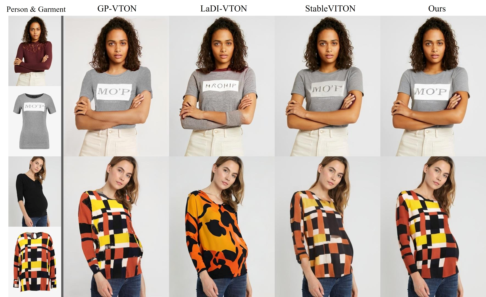

# [ICASSP2025] HYB-VITON: A Hybrid Approach to Virtual Try-On combining Explicit and Implicit Warping
The official implementation of [HYB-VITON](https://arxiv.org/abs/2501.03910). 
This repository is based on [StableVITON](https://github.com/rlawjdghek/StableVITON).




## TODO
- [x] Code for preprocessing
- [x] Code for training hyb-viton
- [x] Code for inference 
- [ ] Instructions for preprocessing
- [ ] Instructions for training 
- [ ] Instructions for inference 

## Environment Setup
> **_NOTE:_**  Adjust the codes bellow to your cuda version.

Create a new conda environment:
```bash
conda create -n hybviton python==3.10.12 -y
conda activate hybviton
```
Install the required packages using the following commands:

```bash
conda install pip -y 
conda install pytorch==2.0.0 pytorch-cuda=11.7 -c pytorch -c nvidia -y
conda install torchvision==0.15.0 torchaudio==2.0.0 -c pytorch -c nvidia -y

pip install opencv-python==4.7.0.72
pip install matplotlib einops omegaconf yacs
pip install pytorch-lightning==1.9.5
pip install open-clip-torch==2.19.0
pip install diffusers==0.20.2
pip install scipy==1.10.1
pip install transformers==4.33.2
pip install scikit-image clean-fid albumentations==1.3.0
conda install -c anaconda ipython -y
pip install xformers==0.0.19
pip install tensorboard
pip install accelerate==0.33.0
```


